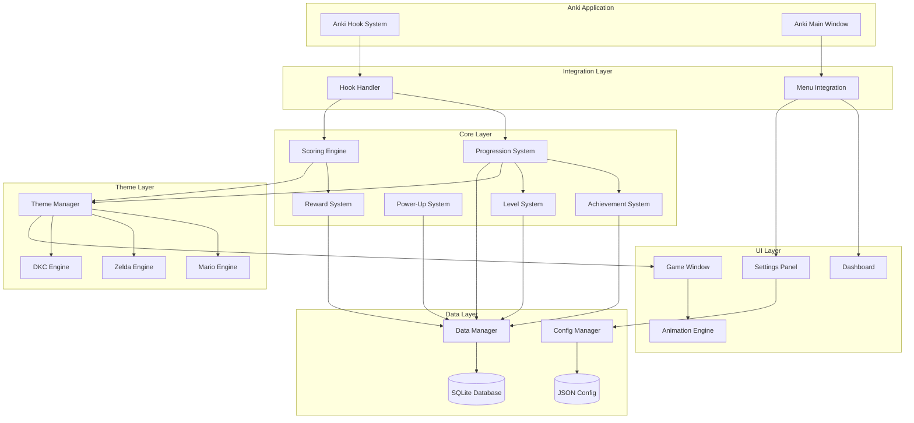
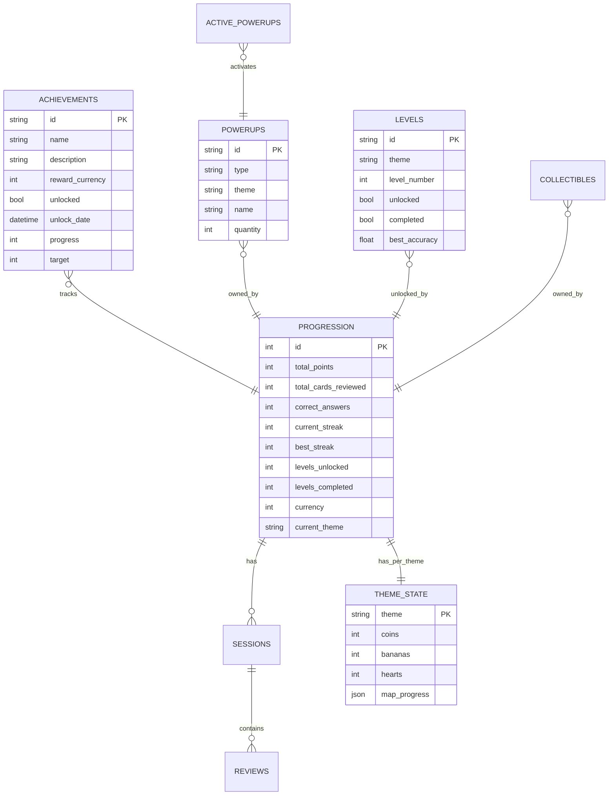

# Design Document: NintendAnki

## Overview

NintendAnki is a gamification add-on for Anki Desktop that transforms the study experience into a Nintendo-inspired gaming adventure. The add-on provides three selectable themes (Mario, Zelda, DKC) with a unified progression system that tracks progress across all Anki decks.

The architecture follows a modular design with clear separation between:
- **Core Logic**: Progression, scoring, achievements, and game state management
- **Theme Engines**: Theme-specific mechanics and visual logic
- **UI Layer**: PyQt-based windows for game display and dashboard
- **Integration Layer**: Anki hook handlers and event processing
- **Data Layer**: SQLite persistence and configuration management

This design prioritizes:
- **Extensibility**: Easy addition of new themes or mechanics
- **Performance**: Non-blocking animations and efficient state updates
- **Reliability**: Robust data persistence with backup/recovery
- **Accessibility**: Configurable visuals, sounds, and difficulty

## Architecture



### Layer Responsibilities

**Integration Layer**
- Registers Anki hooks for card review events
- Adds menu items and toolbar buttons to Anki UI
- Translates Anki events into internal game events

**Core Layer**
- Manages unified progression across all decks/themes
- Calculates scores, streaks, and multipliers
- Tracks achievements and unlocks
- Manages power-ups and their effects
- Controls level unlocking and completion

**Theme Layer**
- Provides theme-specific game mechanics
- Generates theme-appropriate animations
- Manages theme-specific collectibles and rewards

**UI Layer**
- Renders game window with sprite animations
- Displays dashboard with stats and progress
- Provides settings configuration interface

**Data Layer**
- Persists all game state to SQLite
- Manages user configuration in JSON
- Handles backup and recovery

## Components and Interfaces

### Integration Layer

```python
class HookHandler:
    """Handles Anki hook events and dispatches to game systems."""
    
    def __init__(self, progression_system: ProgressionSystem, scoring_engine: ScoringEngine):
        pass
    
    def register_hooks(self) -> None:
        """Register all Anki hooks for card review events."""
        pass
    
    def on_card_reviewed(self, reviewer: Reviewer, card: Card, ease: int) -> None:
        """Called when a card review is completed.
        
        Args:
            reviewer: Anki's reviewer instance
            card: The card that was reviewed
            ease: The ease button pressed (1=Again, 2=Hard, 3=Good, 4=Easy)
        """
        pass
    
    def unregister_hooks(self) -> None:
        """Unregister all hooks on add-on unload."""
        pass


class MenuIntegration:
    """Integrates add-on UI elements into Anki's interface."""
    
    def __init__(self, dashboard: Dashboard, game_window: GameWindow, settings_panel: SettingsPanel):
        pass
    
    def setup_menu(self, main_window: QMainWindow) -> None:
        """Add menu items to Anki's Tools menu."""
        pass
    
    def setup_toolbar(self, main_window: QMainWindow) -> None:
        """Add toolbar button for quick game window access."""
        pass
```

### Core Layer

```python
@dataclass
class ReviewResult:
    """Represents the result of a card review."""
    card_id: int
    deck_id: int
    is_correct: bool
    ease: int
    timestamp: datetime


@dataclass
class ProgressionState:
    """Current state of user progression."""
    total_points: int
    total_cards_reviewed: int
    correct_answers: int
    current_streak: int
    best_streak: int
    levels_unlocked: int
    levels_completed: int
    session_accuracy: float
    session_health: float  # 0.0 to 1.0


class ProgressionSystem:
    """Manages unified progression across all decks and themes."""
    
    def __init__(self, data_manager: DataManager, scoring_engine: ScoringEngine):
        pass
    
    def process_review(self, result: ReviewResult) -> ProgressionState:
        """Process a card review and update progression.
        
        Returns updated progression state.
        """
        pass
    
    def get_state(self) -> ProgressionState:
        """Get current progression state."""
        pass
    
    def check_level_unlock(self) -> Optional[int]:
        """Check if a new level should be unlocked.
        
        Returns level number if unlocked, None otherwise.
        """
        pass
    
    def check_powerup_grant(self) -> Optional[PowerUp]:
        """Check if a power-up should be granted.
        
        Returns PowerUp if granted, None otherwise.
        """
        pass
    
    def reset_session(self) -> None:
        """Reset session-specific state (health, session accuracy)."""
        pass


class ScoringEngine:
    """Calculates scores, streaks, and multipliers."""
    
    def __init__(self, config: GameConfig):
        pass
    
    def calculate_score(self, is_correct: bool, current_streak: int, 
                        session_accuracy: float) -> ScoreResult:
        """Calculate score for a review.
        
        Args:
            is_correct: Whether the answer was correct
            current_streak: Current streak count
            session_accuracy: Current session accuracy (0.0 to 1.0)
            
        Returns:
            ScoreResult with points earned and multipliers applied
        """
        pass
    
    def get_combo_multiplier(self, streak: int) -> float:
        """Get combo multiplier for current streak.
        
        Returns:
            1.0 for streak < 5
            1.5 for streak 5-9
            2.0 for streak 10-19
            3.0 for streak 20+
        """
        pass
    
    def calculate_penalty(self, current_health: float) -> PenaltyResult:
        """Calculate penalty for wrong answer.
        
        Returns:
            PenaltyResult with health reduction and currency loss
        """
        pass


@dataclass
class ScoreResult:
    """Result of score calculation."""
    base_points: int
    multiplier: float
    bonus_points: int
    total_points: int
    streak_broken: bool


@dataclass
class PenaltyResult:
    """Result of penalty calculation."""
    health_reduction: float
    currency_lost: int
    streak_lost: int


class AchievementSystem:
    """Tracks and unlocks achievements."""
    
    def __init__(self, data_manager: DataManager):
        pass
    
    def check_achievements(self, state: ProgressionState) -> List[Achievement]:
        """Check if any achievements should be unlocked.
        
        Returns list of newly unlocked achievements.
        """
        pass
    
    def get_all_achievements(self) -> List[Achievement]:
        """Get all achievements with their unlock status."""
        pass
    
    def get_progress(self, achievement_id: str) -> AchievementProgress:
        """Get progress toward a specific achievement."""
        pass


@dataclass
class Achievement:
    """Represents an achievement."""
    id: str
    name: str
    description: str
    icon: str
    reward_currency: int
    unlocked: bool
    unlock_date: Optional[datetime]


class PowerUpSystem:
    """Manages power-ups and their effects."""
    
    def __init__(self, data_manager: DataManager):
        pass
    
    def grant_powerup(self, powerup_type: PowerUpType, theme: Theme) -> PowerUp:
        """Grant a power-up to the user."""
        pass
    
    def activate_powerup(self, powerup_id: str) -> bool:
        """Activate a power-up from inventory.
        
        Returns True if activation successful.
        """
        pass
    
    def get_active_powerups(self) -> List[ActivePowerUp]:
        """Get currently active power-ups with remaining duration."""
        pass
    
    def get_inventory(self) -> List[PowerUp]:
        """Get all power-ups in inventory."""
        pass
    
    def tick(self, delta_time: float) -> List[PowerUp]:
        """Update active power-up timers.
        
        Returns list of power-ups that expired.
        """
        pass


class LevelSystem:
    """Manages level unlocking and completion."""
    
    def __init__(self, data_manager: DataManager):
        pass
    
    def unlock_level(self, theme: Theme) -> Level:
        """Unlock the next level for a theme."""
        pass
    
    def complete_level(self, level_id: str, accuracy: float) -> LevelReward:
        """Mark a level as completed and calculate rewards."""
        pass
    
    def get_available_levels(self, theme: Theme) -> List[Level]:
        """Get all unlocked levels for a theme."""
        pass
    
    def get_level_progress(self) -> LevelProgress:
        """Get overall level progress stats."""
        pass


class RewardSystem:
    """Manages currency and unlockable rewards."""
    
    def __init__(self, data_manager: DataManager):
        pass
    
    def add_currency(self, amount: int, source: str) -> int:
        """Add currency to user's balance. Returns new balance."""
        pass
    
    def spend_currency(self, amount: int, item_id: str) -> bool:
        """Spend currency on an item. Returns True if successful."""
        pass
    
    def get_balance(self) -> int:
        """Get current currency balance."""
        pass
    
    def get_shop_items(self) -> List[ShopItem]:
        """Get available items for purchase."""
        pass
    
    def unlock_item(self, item_id: str) -> bool:
        """Unlock an item (character, cosmetic). Returns True if successful."""
        pass
```

### Theme Layer

```python
class Theme(Enum):
    MARIO = "mario"
    ZELDA = "zelda"
    DKC = "dkc"


class ThemeManager:
    """Manages theme selection and switching."""
    
    def __init__(self, data_manager: DataManager):
        pass
    
    def get_current_theme(self) -> Theme:
        """Get the currently active theme."""
        pass
    
    def set_theme(self, theme: Theme) -> None:
        """Switch to a new theme."""
        pass
    
    def get_theme_engine(self) -> ThemeEngine:
        """Get the engine for the current theme."""
        pass


class ThemeEngine(ABC):
    """Abstract base class for theme-specific engines."""
    
    @abstractmethod
    def get_animation_for_correct(self) -> Animation:
        """Get animation to play for correct answer."""
        pass
    
    @abstractmethod
    def get_animation_for_wrong(self) -> Animation:
        """Get animation to play for wrong answer."""
        pass
    
    @abstractmethod
    def get_collectible_for_correct(self) -> Collectible:
        """Get collectible earned for correct answer."""
        pass
    
    @abstractmethod
    def get_level_view(self, level: Level) -> LevelView:
        """Get the visual representation of a level."""
        pass
    
    @abstractmethod
    def get_dashboard_stats(self) -> ThemeStats:
        """Get theme-specific stats for dashboard."""
        pass


class MarioEngine(ThemeEngine):
    """Mario theme engine with side-scrolling mechanics."""
    
    def __init__(self, data_manager: DataManager, asset_manager: AssetManager):
        pass
    
    def get_animation_for_correct(self) -> Animation:
        """Mario runs forward and collects a coin."""
        pass
    
    def get_animation_for_wrong(self) -> Animation:
        """Mario takes damage animation."""
        pass
    
    def get_powerup_for_accuracy(self, accuracy: float) -> Optional[MarioPowerUp]:
        """Get power-up based on level accuracy.
        
        95%+ = Mushroom
        98%+ = Fire Flower
        100% = Star
        """
        pass
    
    def get_level_selection_view(self) -> LevelSelectionView:
        """Get Mario-style level selection screen."""
        pass


class ZeldaEngine(ThemeEngine):
    """Zelda theme engine with exploration mechanics."""
    
    def __init__(self, data_manager: DataManager, asset_manager: AssetManager):
        pass
    
    def get_animation_for_correct(self) -> Animation:
        """Link explores and finds an item."""
        pass
    
    def get_animation_for_wrong(self) -> Animation:
        """Link takes damage from enemy."""
        pass
    
    def trigger_boss_battle(self, deck_id: int) -> BossBattle:
        """Trigger a boss battle for deck completion."""
        pass
    
    def complete_boss_battle(self, battle: BossBattle, won: bool) -> BossReward:
        """Complete a boss battle and calculate rewards."""
        pass
    
    def get_adventure_map(self) -> AdventureMap:
        """Get the adventure map with explored regions."""
        pass
    
    def get_equipped_item(self) -> Optional[ZeldaItem]:
        """Get currently equipped functional item."""
        pass
    
    def equip_item(self, item_id: str) -> bool:
        """Equip a functional item."""
        pass


class DKCEngine(ThemeEngine):
    """DKC theme engine with collectible and time trial mechanics."""
    
    def __init__(self, data_manager: DataManager, asset_manager: AssetManager):
        pass
    
    def get_animation_for_correct(self) -> Animation:
        """DK collects bananas."""
        pass
    
    def get_animation_for_wrong(self) -> Animation:
        """DK loses bananas."""
        pass
    
    def start_time_trial(self, duration_seconds: int) -> TimeTrial:
        """Start a time trial challenge."""
        pass
    
    def complete_time_trial(self, trial: TimeTrial, cards_completed: int) -> TimeTrialReward:
        """Complete a time trial and calculate bonus rewards."""
        pass
    
    def get_world_completion(self) -> float:
        """Get world completion percentage (0.0 to 1.0)."""
        pass
    
    def get_banana_count(self) -> int:
        """Get total bananas collected."""
        pass
```

### UI Layer

```python
class GameWindow(QMainWindow):
    """Separate window for game display and animations."""
    
    def __init__(self, theme_manager: ThemeManager, animation_engine: AnimationEngine):
        pass
    
    def show_animation(self, animation: Animation) -> None:
        """Play an animation in the game window."""
        pass
    
    def update_display(self, state: ProgressionState) -> None:
        """Update the display with current game state."""
        pass
    
    def switch_theme(self, theme: Theme) -> None:
        """Switch the visual theme of the game window."""
        pass
    
    def show_level(self, level: Level) -> None:
        """Display a playable level."""
        pass
    
    def minimize_to_tray(self) -> None:
        """Minimize the window to system tray."""
        pass
    
    def restore_position(self) -> None:
        """Restore window position from saved state."""
        pass
    
    def save_position(self) -> None:
        """Save current window position."""
        pass


class AnimationEngine:
    """Handles sprite animations and rendering."""
    
    def __init__(self, asset_manager: AssetManager):
        pass
    
    def load_sprite_sheet(self, path: str) -> SpriteSheet:
        """Load a sprite sheet from file."""
        pass
    
    def create_animation(self, sprites: List[Sprite], fps: int) -> Animation:
        """Create an animation from sprites."""
        pass
    
    def play_animation(self, animation: Animation, target: QWidget) -> None:
        """Play an animation on a target widget."""
        pass
    
    def stop_animation(self) -> None:
        """Stop the current animation."""
        pass
    
    def set_animation_speed(self, speed: float) -> None:
        """Set animation speed multiplier."""
        pass


class Dashboard(QDialog):
    """Dashboard showing stats and progress."""
    
    def __init__(self, progression_system: ProgressionSystem, 
                 achievement_system: AchievementSystem,
                 theme_manager: ThemeManager):
        pass
    
    def refresh(self) -> None:
        """Refresh all displayed data."""
        pass
    
    def show_stats_tab(self) -> None:
        """Show the statistics tab."""
        pass
    
    def show_achievements_tab(self) -> None:
        """Show the achievements tab."""
        pass
    
    def show_powerups_tab(self) -> None:
        """Show the power-ups tab."""
        pass
    
    def show_theme_selector(self) -> None:
        """Show theme selection interface."""
        pass


class SettingsPanel(QDialog):
    """Settings configuration panel."""
    
    def __init__(self, config_manager: ConfigManager):
        pass
    
    def load_settings(self) -> None:
        """Load current settings into UI."""
        pass
    
    def save_settings(self) -> None:
        """Save UI settings to config."""
        pass
    
    def reset_to_defaults(self) -> None:
        """Reset all settings to defaults."""
        pass
```

### Data Layer

```python
@dataclass
class GameState:
    """Complete game state for persistence."""
    progression: ProgressionState
    achievements: List[Achievement]
    powerups: List[PowerUp]
    levels: List[Level]
    currency: int
    cosmetics: List[Cosmetic]
    theme: Theme
    theme_specific: Dict[Theme, ThemeState]


class DataManager:
    """Manages SQLite database operations."""
    
    def __init__(self, db_path: Path):
        pass
    
    def initialize_database(self) -> None:
        """Create database tables if they don't exist."""
        pass
    
    def save_state(self, state: GameState) -> None:
        """Save complete game state to database."""
        pass
    
    def load_state(self) -> GameState:
        """Load complete game state from database."""
        pass
    
    def save_progression(self, progression: ProgressionState) -> None:
        """Save progression state (called after each review)."""
        pass
    
    def export_to_json(self, path: Path) -> None:
        """Export game state to JSON file for backup."""
        pass
    
    def import_from_json(self, path: Path) -> GameState:
        """Import game state from JSON backup."""
        pass
    
    def create_backup(self) -> Path:
        """Create a backup of the database file."""
        pass
    
    def check_integrity(self) -> bool:
        """Check database integrity. Returns True if valid."""
        pass


@dataclass
class GameConfig:
    """User-configurable game settings."""
    # Difficulty
    base_points: int = 10
    penalty_health_reduction: float = 0.1
    penalty_currency_loss: int = 1
    
    # Rewards
    streak_multiplier_5: float = 1.5
    streak_multiplier_10: float = 2.0
    streak_multiplier_20: float = 3.0
    accuracy_bonus_threshold: float = 0.9
    accuracy_bonus_multiplier: float = 1.25
    
    # Unlocks
    cards_per_level: int = 50
    cards_per_powerup: int = 100
    
    # Animation
    animation_speed: float = 1.0
    animations_enabled: bool = True
    
    # Accessibility
    colorblind_mode: Optional[str] = None  # "deuteranopia", "protanopia", "tritanopia"
    sound_enabled: bool = True
    sound_volume: float = 0.7


class ConfigManager:
    """Manages JSON configuration file."""
    
    def __init__(self, config_path: Path):
        pass
    
    def load_config(self) -> GameConfig:
        """Load configuration from JSON file."""
        pass
    
    def save_config(self, config: GameConfig) -> None:
        """Save configuration to JSON file."""
        pass
    
    def reset_to_defaults(self) -> GameConfig:
        """Reset configuration to defaults."""
        pass
```

## Data Models

### Database Schema

```sql
-- Core progression table
CREATE TABLE progression (
    id INTEGER PRIMARY KEY,
    total_points INTEGER NOT NULL DEFAULT 0,
    total_cards_reviewed INTEGER NOT NULL DEFAULT 0,
    correct_answers INTEGER NOT NULL DEFAULT 0,
    current_streak INTEGER NOT NULL DEFAULT 0,
    best_streak INTEGER NOT NULL DEFAULT 0,
    levels_unlocked INTEGER NOT NULL DEFAULT 0,
    levels_completed INTEGER NOT NULL DEFAULT 0,
    currency INTEGER NOT NULL DEFAULT 0,
    current_theme TEXT NOT NULL DEFAULT 'mario',
    updated_at TIMESTAMP DEFAULT CURRENT_TIMESTAMP
);

-- Achievements table
CREATE TABLE achievements (
    id TEXT PRIMARY KEY,
    name TEXT NOT NULL,
    description TEXT NOT NULL,
    icon TEXT NOT NULL,
    reward_currency INTEGER NOT NULL DEFAULT 0,
    unlocked INTEGER NOT NULL DEFAULT 0,
    unlock_date TIMESTAMP,
    progress INTEGER NOT NULL DEFAULT 0,
    target INTEGER NOT NULL
);

-- Power-ups inventory
CREATE TABLE powerups (
    id TEXT PRIMARY KEY,
    type TEXT NOT NULL,
    theme TEXT NOT NULL,
    name TEXT NOT NULL,
    description TEXT NOT NULL,
    icon TEXT NOT NULL,
    quantity INTEGER NOT NULL DEFAULT 1,
    acquired_at TIMESTAMP DEFAULT CURRENT_TIMESTAMP
);

-- Active power-ups (with duration)
CREATE TABLE active_powerups (
    id TEXT PRIMARY KEY,
    powerup_id TEXT NOT NULL,
    activated_at TIMESTAMP NOT NULL,
    duration_seconds INTEGER NOT NULL,
    remaining_seconds REAL NOT NULL,
    FOREIGN KEY (powerup_id) REFERENCES powerups(id)
);

-- Levels table
CREATE TABLE levels (
    id TEXT PRIMARY KEY,
    theme TEXT NOT NULL,
    level_number INTEGER NOT NULL,
    name TEXT NOT NULL,
    unlocked INTEGER NOT NULL DEFAULT 0,
    completed INTEGER NOT NULL DEFAULT 0,
    best_accuracy REAL,
    completion_date TIMESTAMP,
    rewards_claimed INTEGER NOT NULL DEFAULT 0
);

-- Collectibles/cosmetics
CREATE TABLE collectibles (
    id TEXT PRIMARY KEY,
    type TEXT NOT NULL,  -- 'cosmetic', 'character', 'item'
    theme TEXT,  -- NULL for universal items
    name TEXT NOT NULL,
    description TEXT NOT NULL,
    icon TEXT NOT NULL,
    owned INTEGER NOT NULL DEFAULT 0,
    equipped INTEGER NOT NULL DEFAULT 0,
    acquired_at TIMESTAMP
);

-- Theme-specific state (Mario coins, Zelda items, DKC bananas)
CREATE TABLE theme_state (
    theme TEXT PRIMARY KEY,
    coins INTEGER NOT NULL DEFAULT 0,
    bananas INTEGER NOT NULL DEFAULT 0,
    hearts INTEGER NOT NULL DEFAULT 3,
    map_progress TEXT,  -- JSON blob for map state
    extra_data TEXT  -- JSON blob for theme-specific data
);

-- Session history for analytics
CREATE TABLE sessions (
    id INTEGER PRIMARY KEY AUTOINCREMENT,
    started_at TIMESTAMP NOT NULL,
    ended_at TIMESTAMP,
    cards_reviewed INTEGER NOT NULL DEFAULT 0,
    correct_answers INTEGER NOT NULL DEFAULT 0,
    points_earned INTEGER NOT NULL DEFAULT 0,
    theme TEXT NOT NULL
);

-- Review history for detailed tracking
CREATE TABLE reviews (
    id INTEGER PRIMARY KEY AUTOINCREMENT,
    session_id INTEGER NOT NULL,
    card_id INTEGER NOT NULL,
    deck_id INTEGER NOT NULL,
    is_correct INTEGER NOT NULL,
    ease INTEGER NOT NULL,
    points_earned INTEGER NOT NULL,
    streak_at_time INTEGER NOT NULL,
    timestamp TIMESTAMP DEFAULT CURRENT_TIMESTAMP,
    FOREIGN KEY (session_id) REFERENCES sessions(id)
);
```

### Entity Relationships




## Correctness Properties

*A property is a characteristic or behavior that should hold true across all valid executions of a system—essentially, a formal statement about what the system should do. Properties serve as the bridge between human-readable specifications and machine-verifiable correctness guarantees.*

### Property 1: Theme Switching Preserves Progression

*For any* progression state and *for any* theme switch operation, the total points, levels unlocked, levels completed, and achievements should remain unchanged after the switch.

**Validates: Requirements 1.3**

### Property 2: Theme Selection Round-Trip Persistence

*For any* valid theme selection, saving the theme to the database and then loading it should produce the same theme value.

**Validates: Requirements 1.5, 1.6**

### Property 3: Progression Invariants

*For any* sequence of card reviews, the total_points should equal the sum of all individual review points earned, and total_cards_reviewed should equal the count of reviews processed.

**Validates: Requirements 2.1, 2.2, 2.3**

### Property 4: Threshold-Based Unlocks

*For any* progression state with N correct answers, levels_unlocked should equal floor(N / 50) and power-ups granted should equal floor(N / 100).

**Validates: Requirements 2.4, 2.5, 13.1**

### Property 5: Game State Round-Trip Persistence

*For any* valid game state (including progression, achievements, power-ups, levels, currency, cosmetics, and theme-specific data), saving to the database and then loading should produce an equivalent state.

**Validates: Requirements 2.6, 2.7, 8.3, 8.4**

### Property 6: Combo Multiplier Calculation

*For any* streak value N, the combo multiplier should be:
- 1.0 if N < 5
- 1.5 if 5 ≤ N < 10
- 2.0 if 10 ≤ N < 20
- 3.0 if N ≥ 20

**Validates: Requirements 3.3**

### Property 7: Scoring Rules

*For any* correct answer, points awarded should be at least base_points. *For any* wrong answer, either currency should decrease or health should decrease. *For any* session with accuracy ≥ 0.9, the accuracy bonus multiplier (1.25x) should be applied.

**Validates: Requirements 3.1, 3.2, 3.4**

### Property 8: Theme Animation Selection

*For any* theme and *for any* review result, correct answers should produce a "collect" animation type and wrong answers should produce a "damage" animation type, with theme-appropriate visuals.

**Validates: Requirements 4.2, 4.3, 5.2, 5.3, 6.2, 6.3**

### Property 9: Mario Accuracy Rewards

*For any* Mario level completion with accuracy A:
- If 0.95 ≤ A < 0.98, a mushroom power-up should be awarded
- If 0.98 ≤ A < 1.0, a fire flower power-up should be awarded
- If A = 1.0, a star power-up should be awarded

**Validates: Requirements 4.4, 4.5, 4.6**

### Property 10: Zelda Item Categorization

*For any* Zelda item, it should be categorized as exactly one of: functional (usable during reviews) or cosmetic (visual only).

**Validates: Requirements 5.6**

### Property 11: Zelda Item Effects

*For any* boss battle victory, a special item should be awarded. *For any* equipped functional item, a review bonus effect should be active.

**Validates: Requirements 5.5, 5.7**

### Property 12: DKC Time Trial Rewards

*For any* time trial completion with remaining time T > 0, bonus bananas awarded should be proportional to T.

**Validates: Requirements 6.5**

### Property 13: DKC World Completion

*For any* total cards reviewed count N, world completion percentage should be a monotonically increasing function of N, reaching 100% at the defined threshold.

**Validates: Requirements 6.7**

### Property 14: Background Progress Tracking

*For any* card review event, regardless of whether the Game_Window is open or closed, the progression system should update correctly.

**Validates: Requirements 7.5, 9.6**

### Property 15: JSON Backup Round-Trip

*For any* valid game state, exporting to JSON and then importing should produce an equivalent state.

**Validates: Requirements 8.6, 8.7**

### Property 16: Game Window Aspect Ratio Preservation

*For any* window resize operation, sprite aspect ratios should remain unchanged (width/height ratio preserved).

**Validates: Requirements 9.4**

### Property 17: Game Window Position Persistence

*For any* window position and size, saving and then restoring should produce the same position and size values.

**Validates: Requirements 9.5**

### Property 18: Dashboard Displays Required Information

*For any* progression state, the dashboard should display: total points, cards reviewed, current streak, accuracy percentage, levels unlocked, theme-specific stats, all unlocked achievements with dates, and all power-ups in inventory.

**Validates: Requirements 10.2, 10.3, 10.4, 10.5**

### Property 19: Currency Balance Updates

*For any* currency addition of amount A, the balance should increase by exactly A.

**Validates: Requirements 11.1**

### Property 20: Reward Unlocks

*For any* achievement completion, currency should increase by the achievement's reward amount. *For any* unlocked character, it should appear in the character selection list.

**Validates: Requirements 11.4, 11.5, 11.6**

### Property 21: Stats-Only Mode Disables Animations

*For any* review event when stats-only mode is enabled, no animations should be triggered.

**Validates: Requirements 12.4**

### Property 22: Settings Round-Trip Persistence

*For any* valid settings configuration, saving and then loading should produce an equivalent configuration.

**Validates: Requirements 12.8, 12.9**

### Property 23: Power-Up Lifecycle

*For any* granted power-up, it should appear in inventory. *For any* activated power-up, its effect should be active. *For any* timed power-up, remaining duration should be tracked and displayed.

**Validates: Requirements 13.3, 13.4, 13.6**

### Property 24: Achievement Tracking and Persistence

*For any* milestone, progress should be tracked accurately. *For any* milestone reached, the corresponding achievement should be unlocked. *For any* achievement state, saving and loading should preserve unlock status and dates.

**Validates: Requirements 14.1, 14.2, 14.4**

### Property 25: Level Tracking and Rewards

*For any* level, unlock and completion status should be tracked. *For any* level completion, rewards should be granted. *For any* level state, saving and loading should preserve all progress.

**Validates: Requirements 15.2, 15.5, 15.6**

## Error Handling

### Database Errors

| Error Condition | Handling Strategy |
|----------------|-------------------|
| Database file not found | Create new database with default schema |
| Database corruption detected | Create backup of corrupted file, initialize new database, notify user |
| Write failure | Retry up to 3 times with exponential backoff, then queue for later |
| Read failure | Return cached state if available, otherwise return defaults |

### Anki Integration Errors

| Error Condition | Handling Strategy |
|----------------|-------------------|
| Hook registration fails | Log error, continue without game features, notify user |
| Card review event missing data | Skip processing, log warning |
| Anki version incompatible | Display compatibility warning, disable add-on |

### UI Errors

| Error Condition | Handling Strategy |
|----------------|-------------------|
| Asset file missing | Use placeholder sprite, log warning |
| Animation frame drop | Skip frames to maintain timing, reduce quality if persistent |
| Window creation fails | Fall back to dashboard-only mode |

### Configuration Errors

| Error Condition | Handling Strategy |
|----------------|-------------------|
| Config file corrupted | Reset to defaults, create backup of corrupted file |
| Invalid setting value | Use default value, log warning |
| Missing required setting | Use default value |

## Testing Strategy

### Dual Testing Approach

This project uses both unit tests and property-based tests for comprehensive coverage:

- **Unit tests**: Verify specific examples, edge cases, and error conditions
- **Property tests**: Verify universal properties across randomly generated inputs

### Property-Based Testing Configuration

- **Library**: Hypothesis (Python)
- **Minimum iterations**: 100 per property test
- **Tag format**: `# Feature: nintendanki, Property {number}: {property_text}`

### Test Categories

#### Core Logic Tests

| Component | Unit Tests | Property Tests |
|-----------|------------|----------------|
| ScoringEngine | Edge cases (0 streak, max streak), boundary conditions | Property 6, Property 7 |
| ProgressionSystem | Session reset, level boundaries | Property 3, Property 4 |
| AchievementSystem | Specific milestone triggers | Property 24 |
| PowerUpSystem | Activation/deactivation | Property 23 |
| LevelSystem | Unlock thresholds | Property 25 |
| RewardSystem | Purchase flow, insufficient funds | Property 19, Property 20 |

#### Theme Engine Tests

| Component | Unit Tests | Property Tests |
|-----------|------------|----------------|
| ThemeManager | Theme switching | Property 1, Property 2 |
| MarioEngine | Specific power-up awards | Property 8, Property 9 |
| ZeldaEngine | Boss battle triggers | Property 10, Property 11 |
| DKCEngine | Time trial edge cases | Property 8, Property 12, Property 13 |

#### Data Layer Tests

| Component | Unit Tests | Property Tests |
|-----------|------------|----------------|
| DataManager | Corruption handling, backup creation | Property 5, Property 15 |
| ConfigManager | Invalid values, missing file | Property 22 |

#### UI Tests

| Component | Unit Tests | Property Tests |
|-----------|------------|----------------|
| GameWindow | Window lifecycle | Property 16, Property 17 |
| Dashboard | Data display | Property 18 |
| SettingsPanel | Mode toggles | Property 21 |

#### Integration Tests

| Scenario | Test Type |
|----------|-----------|
| Full review cycle | Unit test |
| Theme switch during session | Unit test |
| Background tracking (window closed) | Property 14 |
| Add-on load/unload | Unit test |

### Test File Structure

```
tests/
├── conftest.py                 # Shared fixtures
├── test_scoring_engine.py      # Scoring unit + property tests
├── test_progression_system.py  # Progression unit + property tests
├── test_achievement_system.py  # Achievement tests
├── test_powerup_system.py      # Power-up tests
├── test_level_system.py        # Level tests
├── test_reward_system.py       # Reward tests
├── test_theme_manager.py       # Theme switching tests
├── test_mario_engine.py        # Mario-specific tests
├── test_zelda_engine.py        # Zelda-specific tests
├── test_dkc_engine.py          # DKC-specific tests
├── test_data_manager.py        # Persistence tests
├── test_config_manager.py      # Configuration tests
├── test_game_window.py         # UI tests
├── test_dashboard.py           # Dashboard tests
└── test_integration.py         # End-to-end tests
```
